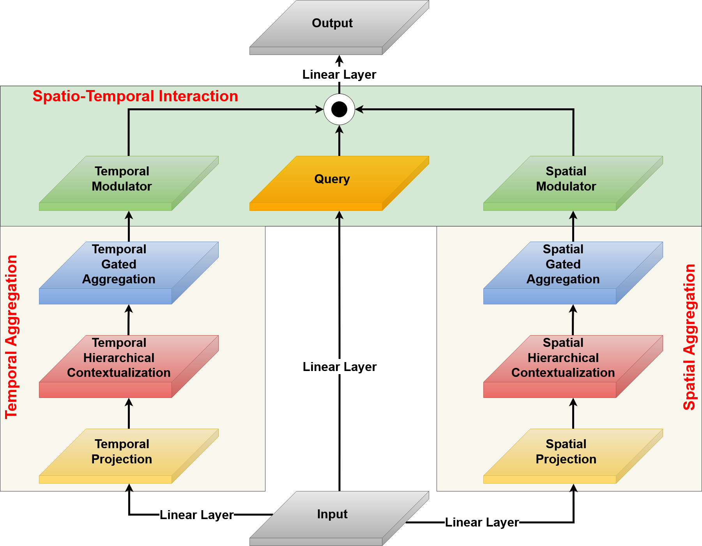
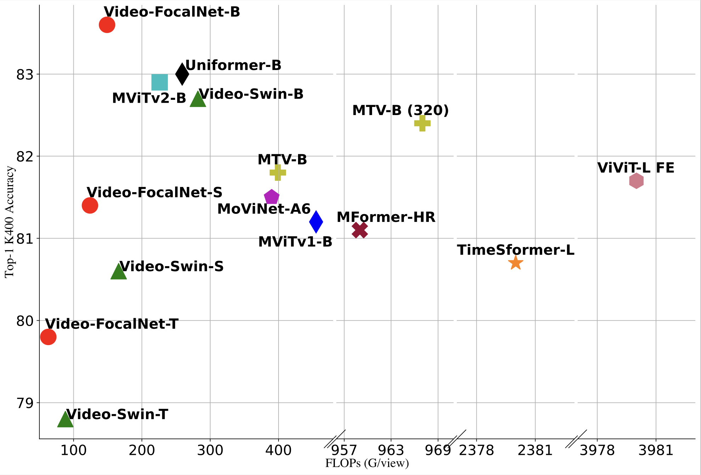

# Official repository for "Video-FocalNets: Spatio-Temporal Focal Modulation for Video Action Recognition" [ICCV 2023] 

[Syed Talal Wasim*](https://talalwasim.github.io),
[Muhammad Uzair Khattak*](https://muzairkhattak.github.io/),
[Muzammal Naseer](https://muzammal-naseer.netlify.app/),
[Salman Khan](https://salman-h-khan.github.io/),
[Mubarak Shah](https://www.crcv.ucf.edu/person/mubarak-shah/),
[Fahad Shahbaz Khan](https://scholar.google.es/citations?user=zvaeYnUAAAAJ&hl=en)

*Joint first authors

[](https://talalwasim.github.io/Video-FocalNets/)
[](https://arxiv.org/abs/2307.06947)
<hr />

> **Abstract:**
>*Recent video recognition models utilize Transformer models for long-range spatio-temporal context modeling. Video transformer designs are based on self-attention that can model global context at a high computational cost. In comparison, convolutional designs for videos offer an efficient alternative but lack long-range dependency modeling. Towards achieving the best of both designs, this work proposes Video-FocalNet, an effective and efficient architecture for video recognition that models both local and global contexts. Video-FocalNet is based on a spatio-temporal focal modulation architecture that reverses the interaction and aggregation steps of self-attention for better efficiency. Further, the aggregation step and the interaction step are both implemented using efficient convolution and element-wise multiplication operations that are computationally less expensive than their self-attention counterparts on video representations. We extensively explore the design space of focal modulation-based spatio-temporal context modeling and demonstrate our parallel spatial and temporal encoding design to be the optimal choice. Video-FocalNets perform favorably well against the state-of-the-art transformer-based models for video recognition on three large-scale datasets (Kinetics-400, Kinetics-600, and SS-v2) at a lower computational cost.*

## Table of Contents
<!--ts-->
   * [News](#rocket-News)
   * [Overview](#overview)
   * [Visualization](#visualization-first-and-last-layer-spatio-temporal-modulator)
   * [Environment Setup](#environment-setup)
   * [Dataset Preparation](#dataset-preparation)
   * [Model Zoo](#model-zoo)
      * [Kinetics-400](#kinetics-400)
      * [Kinetics-600](#kinetics-600)
      * [Something-Something-v2](#something-something-v2)
      * [Diving-48](#diving-48)
      * [ActivityNet-v1.3](#activitynet-v13)
   * [Evaluation](#evaluation)
   * [Training](#training)
   * [Citation](#citation)
   * [Acknowledgements](#acknowledgements)
<!--te-->

## :rocket: News
* **(July 13, 2022)** 
  * Training and evaluation codes for Video-FocalNets, along with pretrained models are released.
<hr />


## Overview

<p align="center">
  
  <p align="center"><b>(a) The overall architecture of Video-FocalNets:</b> A four-stage architecture, with each stage comprising a patch embedding and a number of Video-FocalNet blocks. <b>(b) Single Video-FocalNet block:</b> Similar to the transformer blocks, we replace self-attention with Spatio-Temporal Focal Modulation.</p>
</p>
<hr />
<p align="center">
  <table>
  <tr>
    <td></td>
    <td></td>
  </tr>
  <tr>
    <td><p align="center"><b>The Spatio-Temporal Focal Modulation layer:</b> A spatio-temporal focal modulation block that independently models the spatial and temporal information.</p></td>
    <td><p align="center"><b>Comparison for Top-1 Accuracy vs GFlops/view on Kinetics-400.</b></p></td>
  </tr>
 </table>
</p>

## Visualization: First and Last layer Spatio-Temporal Modulator

<p align="center">
  
</p>

<p align="center">
  
</p>

<p align="center">
  
</p>

<p align="center">
  
</p>

<p align="center">
  
</p>


## Environment Setup
Please follow [INSTALL.md](./INSTALL.md) for installation.

## Dataset Preparation

Please follow [DATA.md](./DATA.md) for data preparation.

## Model Zoo

### Kinetics-400

|       Model      |    Depth   | Dim | Kernels | Frames | Top-1 | Download |
|:----------------:|:----------:|:---:|:-------:|:------:|:-----:|:--------:|
| Video-FocalNet-T |  [2,2,6,2] |  96 |  [3,5]  |   16   |  79.8 |   [ckpt](https://drive.google.com/file/d/1wsUjJbPVQd7pf-OocD9mVU8pak0gdBTP/view?usp=sharing)   |
| Video-FocalNet-S | [2,2,18,2] |  96 |  [3,5]  |   16   |  81.4 |   [ckpt](https://drive.google.com/file/d/1gO4_tluuoR4mn2bSQRNyy9_wFCnUSiQ0/view?usp=sharing)   |
| Video-FocalNet-B | [2,2,18,2] | 128 |  [3,5]  |   16   |  83.6 |   [ckpt](https://drive.google.com/file/d/1tc1AKKmvHN7Hzxpd53QsBIMQZmLH8ozX/view?usp=drive_link)   |

### Kinetics-600

|       Model      |    Depth   | Dim | Kernels | Frames | Top-1 | Download |
|:----------------:|:----------:|:---:|:-------:|:------:|:-----:|:--------:|
| Video-FocalNet-B | [2,2,18,2] | 128 |  [3,5]  |   16   |  86.7 |   [ckpt](https://drive.google.com/file/d/16u1dij3dde0KmaajiB5lAFy8FaRvQDmS/view?usp=sharing)   |

### Something-Something-v2

|       Model      |    Depth   | Dim | Kernels | Frames | Top-1 | Download |
|:----------------:|:----------:|:---:|:-------:|:------:|:-----:|:--------:|
| Video-FocalNet-B | [2,2,18,2] | 128 |  [3,5]  |   16   |  71.1 |   [ckpt](https://drive.google.com/file/d/1MIPLjMVDmYEY5jmJs8pRRIj4gKNVqETg/view?usp=sharing)   |

### Diving-48

|       Model      |    Depth   | Dim | Kernels | Frames | Top-1 | Download |
|:----------------:|:----------:|:---:|:-------:|:------:|:-----:|:--------:|
| Video-FocalNet-B | [2,2,18,2] | 128 |  [3,5]  |   16   |  71.1 |   [ckpt](https://drive.google.com/file/d/1MMZeDucN1cfC5MiTGIft8xNfo5358dA2/view?usp=sharing)   |

### ActivityNet-v1.3

|       Model      |    Depth   | Dim | Kernels | Frames | Top-1 | Download |
|:----------------:|:----------:|:---:|:-------:|:------:|:-----:|:--------:|
| Video-FocalNet-B | [2,2,18,2] | 128 |  [3,5]  |   16   |  89.8 |   [ckpt](https://drive.google.com/file/d/1Zku86i9Ol1gabqBqf0h1vtL-_H5gglA3/view?usp=sharing)   |


## Evaluation

To evaluate pre-trained Video-FocalNets on your dataset:

```bash
python -m torch.distributed.launch --nproc_per_node <num-of-gpus-to-use>  main.py  --eval \
--cfg <config-file> --resume <checkpoint> \
--opts DATA.NUM_FRAMES 16 DATA.BATCH_SIZE 8 TEST.NUM_CLIP 4 TEST.NUM_CROP 3 DATA.ROOT path/to/root DATA.TRAIN_FILE train.csv DATA.VAL_FILE val.csv
```

For example, to evaluate the `Video-FocalNet-B` with a single GPU on Kinetics400:

```bash
python -m torch.distributed.launch --nproc_per_node 1  main.py  --eval \
--cfg configs/kinetics400/video_focalnet_base.yaml --resume video-focalnet_base_k400.pth \
--opts DATA.NUM_FRAMES 16 DATA.BATCH_SIZE 8 TEST.NUM_CLIP 4 TEST.NUM_CROP 3 DATA.ROOT path/to/root DATA.TRAIN_FILE train.csv DATA.VAL_FILE val.csv
```

Alternatively, the `DATA.ROOT`, `DATA.TRAIN_FILE`, and `DATA.VAL_FILE` paths can be set directly in the config files provided in the `configs` directory.
According to our experience and sanity checks, there is a reasonable random variation of about +/-0.3% top-1 accuracy when testing on different machines.


## Training

To train a Video-FocalNet on a video dataset from scratch, run:

```bash
python -m torch.distributed.launch --nproc_per_node <num-of-gpus-to-use>  main.py \
--cfg <config-file> --batch-size <batch-size-per-gpu> --output <output-directory> \
--opts DATA.ROOT path/to/root DATA.TRAIN_FILE train.csv DATA.VAL_FILE val.csv
```

Alternatively, the `DATA.ROOT`, `DATA.TRAIN_FILE`, and `DATA.VAL_FILE` paths can be set directly in the config files provided in the `configs` directory. We also provide bash scripts to train Video-FocalNets on various datasets in the `scripts` directory.


## Citation
If you find our work, this repository, or pretrained models useful, please consider giving a star :star: and citation.
```bibtex
@article{wasim2023videofocalnets,
    title={Video-FocalNets: Spatio-Temporal Focal Modulation for Video Action Recognition},
    author={Syed Talal Wasim and Muhammad Uzair Khattak and Muzammal Naseer and Salman Khan and Mubarak Shah and Fahad Shahbaz Khan},
    journal={arXiv:2307.06947},
    year={2023}
}
```

## Contact
If you have any questions, please create an issue on this repository or contact at syed.wasim@mbzuai.ac.ae or uzair.khattak@mbzuai.ac.ae.

## Acknowledgements
Our code is based on [FocalNets](https://github.com/microsoft/FocalNet), [XCLIP](https://github.com/microsoft/VideoX/tree/master/X-CLIP) and [UniFormer](https://github.com/Sense-X/UniFormer) repositories. We thank the authors for releasing their code. If you use our model, please consider citing these works as well.
